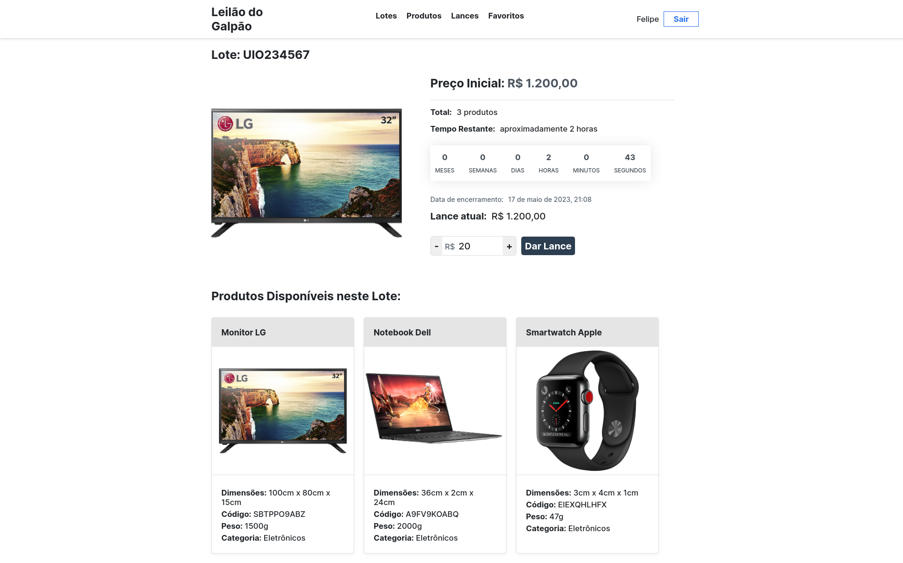
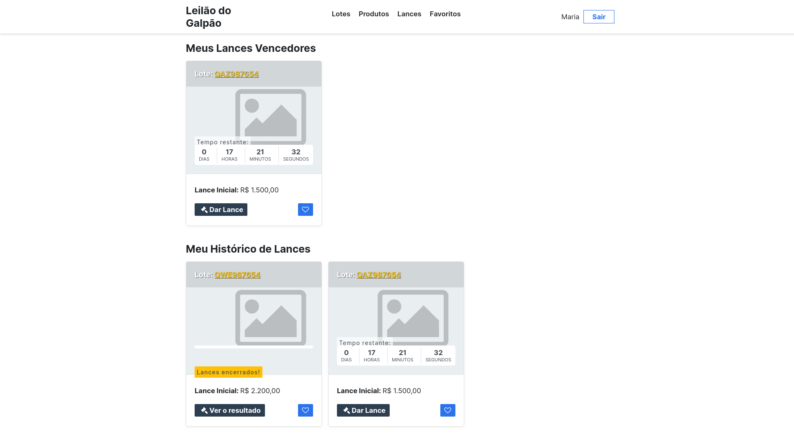
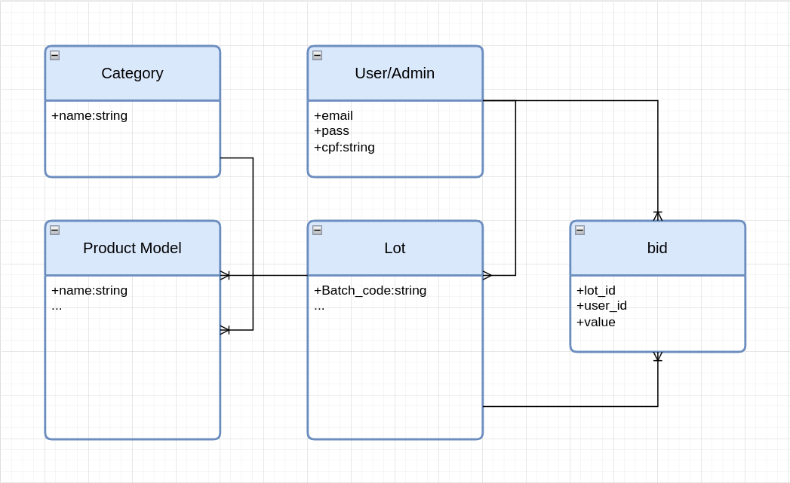

# Leilão do Galpão

<br>

<p align="center">
  <a href="#-tecnologias">Tecnologias</a>&nbsp;&nbsp;&nbsp;|&nbsp;&nbsp;&nbsp;
  <a href="#-funcionalidades-principais">Funcionalidades Principais</a>&nbsp;&nbsp;&nbsp;|&nbsp;&nbsp;&nbsp;
  <a href="#️-arquitetura-do-projeto">Arquitetura do Projeto</a>
</p>

<br>
<br>

## Resumo

Este projeto consiste no desenvolvimento de uma aplicação web utilizando Ruby on Rails, com o objetivo de criar um sistema de leilão para comercializar itens abandonados em galpões. A aplicação terá dois perfis de usuário: administradores, responsáveis pelo cadastro e gestão dos leilões, e visitantes, que poderão criar contas, buscar produtos, ver detalhes e fazer ofertas. O projeto conta com uma lista de tarefas a serem implementadas, com algumas funcionalidades adicionais consideradas bônus.

<br>
<br>

## 🚀 Tecnologias

<table align="center">
  <tbody>
    <tr>
      <td align="center" height="110" width="140">
        
        <br>
        <span>HTML</span>
      </td>
      <td align="center" height="110" width="140">
        
        <br>
        <span>CSS</span>
      </td>
      <td align="center" height="110" width="140">
        
        <br>
        <span>Ruby</span>
      </td>
      <td align="center" height="110" width="140">
        
        <br>
        <span>Rails</span>
      </td>
    </tr>
    <tr>
      <td align="center" height="110" width="140">
        
        <br>
        <span>Devise</span>
      </td>
      <td align="center" height="110" width="140">
        
        <br>
        <span>Rspec</span>
      </td>
      <td align="center" height="110" width="140">
        
        <br>
        <span>Capybara</span>
      </td>
      <td align="center" height="110" width="140">
        
        <br>
        <span>SQLite</span>
      </td>
    </tr>
  </tbody>
</table>

<br>
<br>

## 📋 Funcionalidades Principais

### Cadastro de usuários

A aplicação possui dois tipos de usuários: regulares e administradores. Os usuários regulares podem se cadastrar utilizando qualquer endereço de e-mail, enquanto os administradores devem se cadastrar com um e-mail do domínio _"leilaodogalpao.com.br"_. Além do e-mail, todos os usuários devem fornecer um CPF único e válido para realizar o cadastro.

### Status dos Lotes

Os lotes possuem diferentes status que determinam suas permissões e ações disponíveis:

- **Pendente**: Este é o status padrão para um lote recém-criado. Enquanto estiver pendente, é possível editá-lo e gerenciá-lo. A opção "Editar" permite alterar as configurações do lote, como a data de início e fim. Na opção "Gerenciar", é possível adicionar ou remover um produto. Também é possível aprovar um lote caso já tenha produtos associados a ele.

- **Aprovado**: Quando um administrador diferente do que cadastrou o lote o aprova, ele passa para o status "Aprovado". Nesse estágio, o lote está aberto para receber lances, desde que esteja dentro do período permitido para tal.

- **Encerrado**: Um lote é encerrado quando sua data final é anterior à data atual. Após o encerramento, o lote pode ter dois status adicionais:

  - **Validado**: Caso existam lances registrados no lote, ele será marcado como "Validado". Isso indica que o lote foi concluído com sucesso e os lances foram aceitos.

  - **Cancelado**: Caso nenhum lance tenha sido registrado no lote, ele será marcado como "Cancelado". Isso indica que o lote foi encerrado sem nenhum lance registrado.

### Lances

Na aplicação, os usuários têm a opção de realizar lances em lotes específicos. No entanto, existem algumas restrições e informações relevantes relacionadas aos lances:

- Um usuário só pode fazer um lance se ele não for inferior ao valor mínimo estabelecido para aquele lote.

- Um usuário não pode fazer um lance se o último lance registrado for dele mesmo. Isso evita que um usuário aumente o valor do seu próprio lance ou que ele de lances duplicados sem querer.

> Imagem da tela de lances:
>
>  

- O usuário pode visualizar todas os lances que deu na tela de lances. Essa tela apresenta duas informações principais:

  - **Todos os lances que o usuário está ganhando**, ou seja, será mostrado todos os lotes que o usuário está vencendo/venceu, independentemente se o lote esteja encerrado ou não.
  - **Todos os lances** dados pelo usuário, incluindo lances em lotes que ele ganhou e lotes em que foi superado por outros lances.

> Imagem da tela de histórico de lances:
>
>  

<br>
<br>

## 🏗️ Arquitetura do Projeto

Durante a realização deste projeto, percebi que tomei algumas decisões inadequadas em relação ao início do desenvolvimento. Por não ter experiência prévia com bancos de dados, acabei cometendo erros na escolha dos modelos e, como resultado, enfrentei dificuldades ao longo do caminho para alcançar o funcionamento desejado. Embora não esteja certo se a implementação está ok, estou satisfeito com o progresso que fiz até o momento. Mas aguardo um feedback para saber como deveria ser feito ou o que eu poderia melhorar. :)

A seguir, está uma representação visual de como inicialmente imaginei a relação entre as tabelas:



<br>
<br>

## ☕ Instruções para executar o projeto

1. Clonar o projeto:

```bash
git clone https://github.com/felipel7/ruby-treinadev-stock_auction.git
```

2. Instalar as dependências do projeto:

```bash
# Na pasta raiz, digite o comando:
bundle install
```

3. Configurar o banco de dados:

```bash
rails db:migrate

rails db:seed
```

4. Executar o servidor Rails:

```bash
rails server
```

Abra o navegador e digite `http://localhost:3000`

<br>

**Entrar como usuário regular:**

E-mail usuários:

```bash
felipe@gmail.com
# ou
maria@gmail.com
```

<br/>

**Entrar como administrador:**

E-mail administradores:

```bash
maria@leilaodogalpao.com.br
# ou
fernando@leilaodogalpao.com.br
```

Todos as senhas são **123123**

<br>

Feito com carinho ♡ por Felipe Silva :) [Linkedin](https://www.linkedin.com/in/ggfelipesilva/)

[⬆ Voltar ao topo](#Resumo)

<br>
